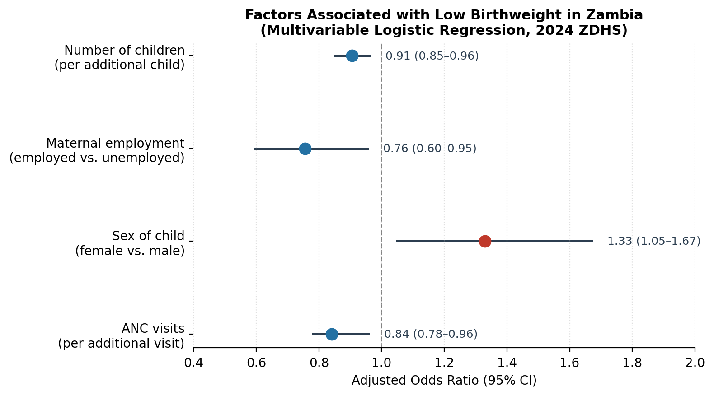

# Factors Associated with Low Birthweight in Zambia
### A statistical case study using the 2024 Zambia Demographic and Health Survey (ZDHS)

**Author:** Chipo [Surname] · MSc Medical Statistics
**Tools:** Stata 17 · Descriptive statistics · Hypothesis testing · Logistic regression
**Data:** 2024 ZDHS, n = 3,761 mother-infant pairs

---

## The Question

Low birthweight (LBW) — defined by WHO as birthweight below 2,500g — is one of the
strongest predictors of infant mortality, childhood illness, and long-term
developmental outcomes. Globally, LBW affects 14–15% of live births, with the
heaviest burden in sub-Saharan Africa.

Zambia collects rich, nationally representative maternal and child health data
through the ZDHS, but that data is only useful if it's turned into evidence
that can inform where limited public health resources go. This project asks:
**which maternal, socioeconomic, and healthcare-access factors are actually
driving low birthweight in Zambia — and which commonly assumed drivers turn
out not to matter once you control for the others?**

## Approach

Rather than running a single regression and calling it done, this analysis
follows a full applied-statistics workflow:

1. **Descriptive profiling** of 3,761 mother-infant pairs across 10 candidate
   factors (residence, education, wealth, employment, parity, child sex,
   maternal age, marital status, BMI, ANC attendance).
2. **Method-appropriate bivariate testing** — the right test for the right
   variable type, not a one-size-fits-all approach:
   - Chi-square tests for categorical vs. categorical associations
   - Cuzick's non-parametric trend test for ordinal exposures (education,
     wealth, BMI category)
   - Distributional checks (Shapiro-Wilk, histograms, kernel density) to
     decide between t-tests and rank-sum tests for continuous variables
3. **Unadjusted logistic regression** to get a crude odds ratio for every
   candidate factor on its own.
4. **Backward stepwise multivariable regression** — starting from all 10
   variables and removing the weakest one at a time — to arrive at a final
   model containing only factors with independent, statistically significant
   associations with LBW.

Full annotated code: [`analysis.do`](analysis.do)

## Key Finding

Of 10 candidate factors, only **four** remained independently associated with
low birthweight after adjusting for the others:

| Factor | Adjusted OR (95% CI) | Interpretation |
|---|---|---|
| Number of children | 0.91 (0.85–0.96) | Each additional child is associated with ~10% lower odds of LBW |
| Maternal employment | 0.76 (0.60–0.96) | Employed mothers have ~25% lower odds of LBW than unemployed mothers |
| Sex of child (female vs. male) | 1.33 (1.05–1.67) | Female infants have ~33% higher odds of LBW than male infants |
| ANC visits | 0.84 (0.78–0.96) | Each additional antenatal care visit is associated with ~16% lower odds of LBW |

Notably, **residence, maternal education, wealth status, marital status, and
maternal BMI — factors often assumed to be strong predictors — showed no
significant independent association** once the model adjusted for the other
variables. This is a useful finding in its own right: it suggests that in
Zambia's context, direct healthcare-seeking behavior (ANC attendance) and
maternal workforce participation may matter more to birth outcomes than broad
socioeconomic status.

## So What?

For a public health decision-maker, this points to two actionable levers
that are more tractable than "reduce poverty" or "increase education":

- **Antenatal care attendance is a modifiable, trackable intervention point.**
  Programs that increase ANC visit frequency (reminders, transport subsidies,
  community health worker outreach) have a clear, quantifiable link to
  reduced LBW risk in this dataset.
- **Maternal employment and economic participation matter independently of
  household wealth.** This suggests interventions supporting women's income
  generation during pregnancy may have benefits beyond household income
  level alone.

## Limitations

- Cross-sectional design — associations, not causation.
- Secondary data — subject to missingness and measurement error inherent to
  large household surveys.
- Some clinically relevant variables (gestational age, smoking status,
  nutritional intake, pregnancy complications) were not available in this
  extract and could confound the observed associations.

## A Note on Data Integrity

This project began as an academic assignment. In preparing it for this
portfolio, two transcription inconsistencies were caught during review — one
in the reported direction of the child-sex association, and one in a
confidence interval that didn't logically bracket its point estimate. Both
were corrected against the original analysis before publishing here. I'm
noting this openly because catching and correcting your own errors before
they reach a decision-maker is, in my view, as much a part of the job as
running the model in the first place.

## Data Access

ZDHS microdata is distributed under the DHS Program's data-use agreement and
is not redistributed in this repository. Analysis code is provided so the
methodology can be reviewed and adapted to comparable datasets.

## Skills Demonstrated

`Statistical inference` `Logistic regression` `Model selection` `Stata`
`Public health data analysis` `Data visualization` `Technical writing`
